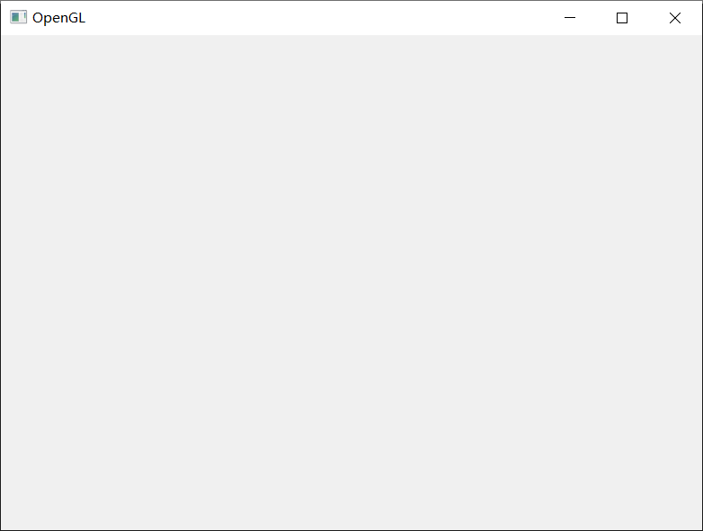

# 快速入门
本节将介绍如何使用 Tension Engine，并使用 Tension Engine 快速创建一个简单的游戏。

- [快速入门](#快速入门)
  - [环境配置](#环境配置)
    - [安装 C++](#安装-c)
    - [编译 Tension Engine](#编译-tension-engine)
    - [安装 IDE](#安装-ide)
  - [Hello Tension](#hello-tension)
    - [CMakeLists.txt](#cmakeliststxt)
    - [main.cpp](#maincpp)
    - [编译运行](#编译运行)

## 环境配置
Tension Engine 使用 C++ 进行编写，因此您需要先安装 C++ 环境。

### 安装 C++
Tension Engine 要求至少使用 C++11。理论上，您可以使用 C++11 以后的任意一个版本，但若遇到问题，请使用 C++11。

Tension Engine 使用 CMake 工具进行构建，要求 CMake 版本至少为 3.22.1。我们推荐游戏程序也使用 CMake 进行构建，本教程也介绍使用 CMake 编写游戏的方式，但若您对其他构建工具更加熟悉，也可以使用其他构建工具。

完成 C++ 环境配置后，可以继续后面的步骤。

### 编译 Tension Engine
Tension Engine 使用源代码方式进行提供，您首先需要将源代码编译为目标平台的二进制文件。

```shell
cd <path-to-TensionEngine>
mkdir build
cd build
cmake ..
cmake --build . --config Release
cmake --install . --prefix=../output
```

完成后，可以在 `output` 文件夹中看到编译后的所有文件。

> 如果需要进行交叉编译，请修改命令中 `cmake ..` 语句。具体内容请查询 CMake 手册。

### 安装 IDE
Tension Engine 可以使用任意文本编辑器+命令行终端进行开发，本教程也采用这种方式介绍如何使用 Tension Engine。

尽管如此，我们也推荐在实际开发时使用 IDE 工具。IDE 工具提供了非常强大的辅助功能，如果您计划使用 IDE 工具，可以参考下面的列表：

- Visual Studio
- Visual Studio Code
- CodeBlocks
- CLion
- Android Studio （如果您需要在 Android 平台运行您的游戏，请选择这一项）

## Hello Tension
本节中将介绍如何创建 Tension 项目。

### CMakeLists.txt
首先在 CMakeLists.txt 中配置项目信息。注意在代码中修改 TENSION_PATH 变量，以使其指向 Tension Engine 的编译输出文件夹。
```cmake
cmake_minimum_required(VERSION 3.22.1)
project(HelloTension VERSION 1.0.0)

set(TENSION_PATH <path-to-TensionEngine-output>)
include_directories(${TENSION_PATH}/include)
link_directories(${TENSION_PATH}/lib)
add_executable(HelloTension main.cpp)
target_link_libraries(HelloTension TensionCore)

install(TARGETS HelloTension)
```
在 `add_executable` 函数中指定了程序源文件，在创建新文件时记得更新这里的配置。

> 这个配置使用的是动态链接，如果希望使用静态链接，请将 TensionCore 修改为 TensionCoreStatic，并添加宏定义 `add_definitions(-DTENSION_CORE_STATIC)`

### main.cpp
编写入口函数
```cpp
#include <tension/core.h>

int main(int argc, char **argv) {
  return tension::core::Exec(argc, argv);
}
```
入口函数仅仅调用了 Tension Engine 的 tension::core::Exec 函数，并没有做其他任何内容。但现在程序已经可以运行了。

### 编译运行
假设您当前正在 Windows 系统上开发，那么编译过程将是这样的：
```shell
cd <path-to-HelloTension>
mkdir build
cd build
cmake ..
cmake --build . --config Release
cmake --install . --prefix=../output
```

之后，在 output 文件夹中将得到一个应用程序文件。双击打开即可得到这样的界面：


> 如果您选择使用动态库，那么您可能需要将 TensionCore.dll 复制到同一文件夹中。